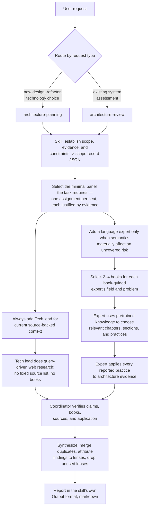

# Roundtable workflow

Both skills run the same flow; only scope, expert analysis, final verification,
and report format differ. Every agent returns structured JSON against a
contract; the coordinator's final answer is the only markdown.

## Shared expert execution

After scope and panel selection, both skills run these stages:

1. Start every expert independently with a non-inheriting spawn
   (`fork_turns: "none"` or the platform equivalent), then provide only the
   inputs named below. If the platform cannot guarantee that isolation, stop
   instead of simulating or forking an expert from coordinator or Librarian
   history. Give every expert the same scope and evidence in an assignment
   whose `output_contract` is selected by the skill. The mandatory
   [Tech lead](agents/tech-lead.md) receives `tech-lead-current-brief.json`;
   every book-guided expert receives the invoking skill's expert contract and
   follows the [shared expert protocol](agents/expert-protocol.md).
2. Continue the Tech lead in its isolated context. It uses available web-search
   tools to find current technical sources by query relevance, authority,
   recency, and depth. Do not hardcode or require a fixed source list; examples
   such as official engineering blogs, standards, preprints, issue trackers,
   public technical discussions, Hacker News, and X threads are source shapes,
   not an allowlist. The Tech lead does not request books, use the Librarian,
   or cite unsupported current claims. It must return at least one source note;
   if web search is unavailable or no relevant source can be found, the
   coordinator treats the Tech lead step as blocked instead of accepting a
   source-free brief.
3. Start one isolated shared [Librarian](agents/librarian.md). Each book-guided
   expert sends its book request to the coordinator, which relays it to the
   Librarian and receives the response. Never allow direct expert-Librarian
   messaging. Each request is matched to both the expert's expertise and the
   concrete architecture problem. The Librarian returns two to four exact
   editions and fit reasons, but no verification sources, section names,
   summaries, principles, excerpts, or analysis. Validate each book list before
   use.
   The Librarian privately accepts a book only when it recognizes the exact
   title-author-edition tuple from pretrained knowledge and can recall at least
   three distinctive book-specific ideas. It rejects uncertainty without
   exposing the check, confidence, recalled ideas, or training-data claims to
   the expert. Treat this as a familiarity filter, not proof of exact
   training-set membership, because models cannot inspect their training
   corpus. The book-list response goes only to the coordinator. If it contains
   `insufficient_familiar_books`, do not forward it to the expert; revise the
   assignment or stop and ask the user. For a selected list, reject blank,
   vague, or duplicate metadata and independently confirm each exact
   title-author-edition tuple against official author or publisher material
   before forwarding the list to the expert. Also reject and retry any fit or
   rationale that exposes confidence, familiarity checks, recalled material,
   training-data claims, or named or paraphrased book-specific content. Require
   `expert_role` and `architecture_problem` to exactly equal the original book
   request; reject the record if either differs, so those fields cannot carry
   hidden Librarian content. Never forward the raw Librarian record. Rebuild a
   clean book-list record from the original request fields, verified identity,
   and sanitized high-level fit fields. Sort books by exact title, author, then
   edition and assign sequential ids `b1` through `bN` in the coordinator so
   Librarian-supplied order and ids cannot become covert channels.
4. Continue each book-guided expert in the same isolated context started in
   step 1. That context may contain only its expert definition, protocol,
   assignment, and coordinator-validated book list. Exclude coordinator history,
   Librarian instructions, raw or unvalidated Librarian responses, the private
   familiarity gate, and other experts' contexts. Explicitly instruct the expert
   to use its pretrained knowledge of the selected books. Do not search for,
   download, or require book copies.
5. Each book-guided expert chooses relevant chapters and sections based on its
   field and the concrete architecture problem. Every reported chapter must
   name at least one section and contribute at least one practice applied to
   concrete architecture evidence. If the expert cannot confidently recall a
   relevant practice and its location, it rejects that book and requests one
   replacement.
6. Have every expert complete its JSON before synthesis. Validate every response
   against the assignment's output contract. Reject source claims, chapter
   names, sections, practices, or applications that are vague, internally
   inconsistent, or unsupported.
7. Verify claims in a
   [verification record](contracts/verification-record.json). For every book,
   independently find official author or publisher material and confirm its
   exact title, author, and edition. Verify the chapter structure and each
   chapter-practice association using official author or publisher material
   when available, otherwise reliable public bibliographic or preview material.
   This verification never limits selection to free books and does not require
   a complete copy. Verify that every stated application follows from the
   architecture evidence. The coordinator may confirm or reject an entry but
   never rewrite it or invent an application. Retry an unverifiable entry once,
   then remove its authority and record why. Describe the result as verified
   book-grounded use of pretrained knowledge, not runtime reading or proof of
   training-set membership. For every Tech lead source used in the report,
   verify the URL, source date or version when exposed, relevance to the
   architecture question, and how the observation applies to the concrete
   evidence. For each major recommendation, option, or evolution step, record a
   production-proof assessment: `direction` for architecture/source support,
   `provider` for target-provider support without a run, or `operational` only
   when a real command, test, deploy, or drill proved it. Name the missing proof
   and the next smallest delegated proof spec. The panel designs proof work; it
   does not implement or run missing proof unless the user separately asks for
   execution.

## Contracts

Each output is a JSON Schema in [contracts/](contracts/). The shared expert
protocol declares expert contracts; the Librarian declares its own interface.
Each agent sees only those contracts. The expert output contract is chosen by
the invoking skill:

Before using any book list, expert response, or verification record, the
coordinator checks it against the named contract and returns invalid JSON to
its producer for correction. A plausible shorthand is not a contract-valid
record. Verification may confirm or reject expert evidence; the coordinator
never substitutes its own book practices or applications.

| Contract | Producer | Consumer | Used by |
|----------|----------|----------|---------|
| [contracts/scope.json](contracts/scope.json) | coordinator | coordinator (audit record) | both skills |
| [contracts/expert-assignment.json](contracts/expert-assignment.json) | coordinator | each expert | both skills |
| [contracts/book-request.json](contracts/book-request.json) | each book-guided expert | Librarian | both skills |
| [contracts/book-list.json](contracts/book-list.json) | Librarian | coordinator; requesting expert only after identity validation | both skills |
| [contracts/tech-lead-current-brief.json](contracts/tech-lead-current-brief.json) | Tech lead | coordinator | both skills |
| [contracts/expert-planning-proposal.json](contracts/expert-planning-proposal.json) | each book-guided expert | coordinator | architecture-planning |
| [contracts/expert-review-analysis.json](contracts/expert-review-analysis.json) | each book-guided expert | coordinator | architecture-review |
| [contracts/verification-record.json](contracts/verification-record.json) | coordinator | coordinator (audit record) | both skills |

Programming-language experts use the invoking skill's expert contract with
their language as `role` (for example `"role": "language:typescript"`).
The Tech lead uses only `tech-lead-current-brief.json` with `"role":
"tech-lead"`.

The scope record grounds every seat justification and the report's context.
The expert contracts record chapter and section locations plus practice
application. The tech lead contract records current sources and the
observations they shaped. The verification record is where each book identity,
source, reported item, application, and production-proof assessment earns its
confirmed entry.

## Report — coordinator to user

The coordinator consumes the expert JSON, verifies it, and writes the
user-facing report in the invoking skill's own `Output` section — markdown
prose, with every finding and upheld practice attributed to the lens that
produced it. Report each book's chapters and sections used, practices applied,
source-backed Tech lead observations used, and verification verdict. Expert
JSON stays internal working data.
Separate architecture direction from production proof: include confidence,
evidence, missing proof, and the next smallest delegated proof spec for each
major recommendation.
